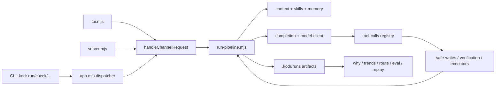

# Kodr Architecture Assessment

This document describes the current system, its dependency boundaries, and its
remaining architectural risks. It is an assessment, not a phase narrative.

Snapshot: phase 239, Node.js 24, zero runtime dependencies. The repository has
98 source modules under `src/` (about 32,300 lines) and 86 native `node:test`
files (about 44,500 lines, including the extractable repomap package).

## Executive assessment

Kodr has a sound architectural center: every user-facing surface converges on a
shared request channel and a single run pipeline. Model output is treated as
untrusted, writes pass through a workspace jail and backup layer, commands are
allowlisted, and every run emits artifacts that make behavior inspectable.

The primary risk is concentration rather than missing structure. The core run
state machine still carries generation, staged execution, apply, verification,
healing, artifact, and session concerns in one module. The CLI parser has the
same issue for option declaration, precedence, validation, and command grammar.
Phase 239 extracted help text, run-summary rendering, and staged pipeline tests,
but `run-pipeline.mjs` and `cli/args.mjs` remain the next decomposition targets.

## System flow

The important invariant is that CLI, TUI, and HTTP do not maintain independent
execution implementations. They translate input into channel requests and use
the same pipeline and artifact contracts.

## Architectural layers

### 1. Presentation and request routing

- `app.mjs` parses process-level intent, resolves CLI defaults, lazy-loads leaf
  commands, and owns `handleChannelRequest`.
- `cli/args.mjs`, `cli/options.mjs`, and `cli/defaults.mjs` resolve options.
  `cli/usage.mjs` is presentation-only help text.
- `tui.mjs` owns the line-oriented interactive session state.
- `server.mjs` exposes the local HTTP/SSE surface. It validates local Host and
  Origin values and requires JSON content types before dispatching mutations.
- `commands/*.mjs` contain leaf command adapters. They depend inward on domain
  modules and receive the shared channel or `runPrompt` when needed.

### 2. Core run engine

- `run-pipeline.mjs` is the main orchestration state machine. It builds context,
  calls the model, interprets proposals and tool drafts, applies writes, runs
  deterministic gates and tests, invokes healing, and finalizes artifacts.
- `completion.mjs` manages continuation turns and loop budgets.
- `model-client.mjs` owns OpenAI-compatible HTTP and SSE transport, deadlines,
  usage extraction, and bounded response accumulation.
- `tool-calls.mjs` owns the model-callable registry and `ProposalDraft`, which is
  the bridge between native write tools and proposal-envelope fallback.
- `run-summary.mjs` renders the human run result without participating in the
  state machine.

The proposal draft and the on-disk workspace are separate states in proposal
mode. In live mode, writes land immediately but still record backup and manifest
metadata. Changes to this boundary require tests for both modes and for staged
and healing reuse of the shared draft.

### 3. Safety and verification

- `safe-writes.mjs` validates workspace-relative paths, rejects symlink escape,
  prepares diffs and backups, and applies whole files or exact patches.
- `git-workspace.mjs` and `undo.mjs` record tree state, constrain git commands,
  and restore the last unchanged applied run.
- `verification-runner.mjs`, `syntax-gate.mjs`, `smoke-check.mjs`, and
  `cross-ref-sensor.mjs` form the deterministic verification layer.
- `permission-policy.mjs`, `command-hooks.mjs`, and `skill-execution.mjs` gate
  effects that extend beyond ordinary jailed reads and writes.
- `active-executor.mjs` selects host, Docker, or OpenShell execution. Heavy
  backends stay behind dynamic imports.

The verification allowlist prevents shell parsing, but package-manager test
commands still execute workspace-owned package scripts. That is an explicit
trusted-workspace boundary, not a sandbox guarantee.

### 4. Context and inspection

- `context-packer.mjs` builds bounded whole-file or file-map context.
- `repomap/*`, `inspection-output.mjs`, and
  `external-inspector-registry.mjs` provide structural inspection and optional
  LSP enrichment.
- `skills.mjs`, `builtin-skills.mjs`, `agents.mjs`, and `system-env.mjs` assemble
  untrusted instructions and environment facts with byte limits.
- `memory.mjs` and `session-compaction.mjs` preserve multi-turn continuity while
  retaining raw conversations separately from compact model-facing messages.

`src/repomap` mirrors `packages/repomap/src` so the CLI and extractable package
share behavior. A sync test protects this duplication, but a generated package
or workspace-based source-of-truth would be cleaner if publishing resumes.

### 5. Optional orchestration and research surfaces

- `orchestration.mjs`, `subagents.mjs`, `agents.mjs`, `workflow.mjs`, and
  `cycles.mjs` implement planning and multi-agent execution.
- `forensics.mjs`, `trends.mjs`, `routing.mjs`, `eval*.mjs`, `bench.mjs`,
  `compare.mjs`, and `replay.mjs` consume run artifacts. They are not required
  for a normal run.
- `server.mjs` and `src/web/*` provide a local UI over the shared channel.
- Docker, OpenShell, LSP, MCP, orchestration, and web command paths are lazy
  loaded so the basic local run does not import every optional capability.

## Data and state

The workspace is the source of truth for code. `.kodr/runs/<id>/` is an
append-only evidence record containing prompts, context, raw request/response,
conversation, proposed and applied writes, verification, usage, and summary
metadata. `.kodr/backups/` supports undo, while `.kodr/last-run` identifies the
latest session for continuation and forensics.

In-memory state is intentionally short-lived except for a TUI session or HTTP
server process. The HTTP run registry is operational state, not the durable run
archive; completed evidence belongs in the run directory.

## Trust boundaries

Kodr must assume the following are hostile or malformed:

- model responses and native tool arguments;
- workspace source, package scripts, memory, `AGENTS.md`, and skills;
- HTTP requests to the local server;
- fetched network content and DNS answers;
- replayed artifacts and external inspector output.

Current boundary mechanisms include workspace path jailing, symlink rejection,
proposal/apply separation, git-aware backups, command allowlists, permission
prompts, response and context byte limits, redirect refusal, DNS-address pinning,
local HTTP Host/Origin validation, and optional Docker/OpenShell execution.

These mechanisms reduce risk but do not make host execution safe for an
untrusted repository. `npm test`, hooks, LSP servers, and explicitly approved
skill helpers can execute repository-controlled code.

## Testing architecture

Tests use `node:test` and Node built-ins. The fake model and LSP servers exercise
real HTTP framing without external services. Focused suites cover transport,
safe writes, verification, server routing, sensors, tools, and orchestration.

Phase 239 moved staged state-machine coverage out of the 9,692-line
`app.test.mjs`; the resulting files are approximately 6,600 lines for general
app integration and 3,200 lines for staged execution. This is still large, but
the failure domain is now explicit. Behavior tests should avoid tight real-time
subprocess deadlines unless timeout behavior itself is under test.

## Current hotspots and recommended direction

1. **Split the core run state machine.** `runPrompt` is still roughly 1,640
   lines and `runStagedPrompt` roughly 640. Extract explicit context-build,
   model-loop, apply/verify, and finalization services with data-only inputs and
   outputs. Preserve the shared artifact and proposal contracts.
2. **Make CLI options declarative.** `parseArgs` remains roughly 840 lines.
   A single option schema should drive parsing, validation, config precedence,
   and help generation so documentation cannot drift from behavior again.
3. **Keep historical reasoning out of control flow.** Production comments
   should explain invariants and failure modes; phase chronology belongs in
   phase, process, and blog records.
4. **Eliminate the repomap mirror when packaging permits.** Prefer one source
   tree and a deterministic package build over two committed copies.
5. **Continue real boundary probes.** Mocked tests are necessary but not
   sufficient for LM Studio, Docker, OpenShell, LSP, DNS, and browser security
   behavior.

The architecture is viable and well tested. The next quality gains come from
making the existing state transitions smaller and explicit, not from adding
more execution modes.
